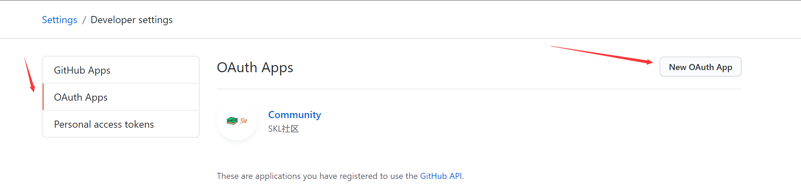

5# blog-community
# 工程简介

## 资料
[Spring 文档](https://spring.io/guides)

[Spring Web](https://spring.io/guides/gs/serving-web-content/)

[es](https://elasticsearch.cn/explore)

[Github deploy key](https://developer.github.com/v3/guides/managing-deploy-keys/#deploy-keys)

[Bootstrap](https://v3.bootcss.com/getting-started/)

[Github 0Auth](https://developer.github.com/apps/building-oauth-apps/creating-an-oauth-app/)

##工具
[Git](https://git-scm.com/download)

[Visual Paradiqm](https://www.visual-paradigm.com)

## 使用github和gitee授权登录
[github授权登录--Github OAuth](https://developer.github.com/apps/building-oauth-apps/creating-an-oauth-app/)
## 授权文档
[文档](https://developer.github.com/apps/building-oauth-apps/authorizing-oauth-apps/)

## 数据库
[h2:一个内嵌的数据库](https://www.h2database.com/html/main.html)
## 数据库迁移
[flyway](https://flywaydb.org/getstarted/) 
```sh
在pom中配置后可运行mvn flyway:migrate
```
## MyBatis Generator With Maven
```sh
mvn -Dmybatis.generator.overwrite=true mybatis-generator:generate

```

## github登录设置

没服务器回调地址可以写本地
```shell
github.client.id= 
github.client.secret =
github.redirect.uri = 
```

## markdown 编辑器
[Editor.md](https://pandao.github.io/editor.md/)

## markdown编辑器的图片上传
在配置文件中设置

